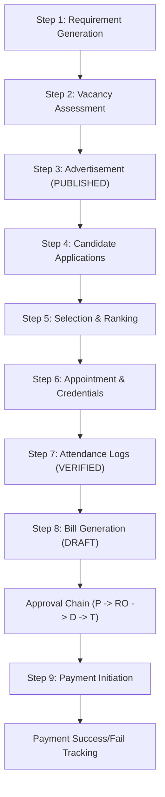
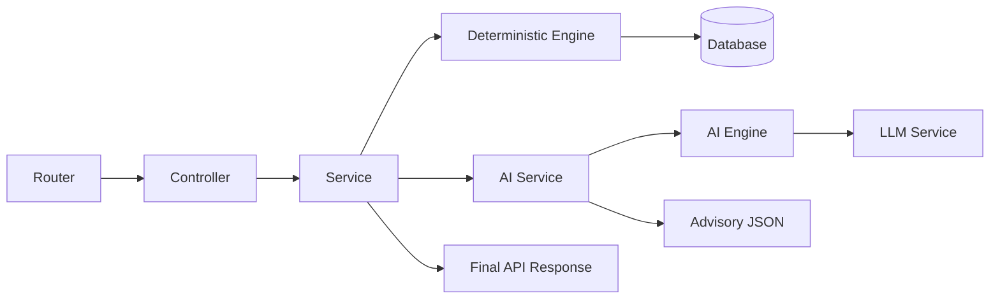
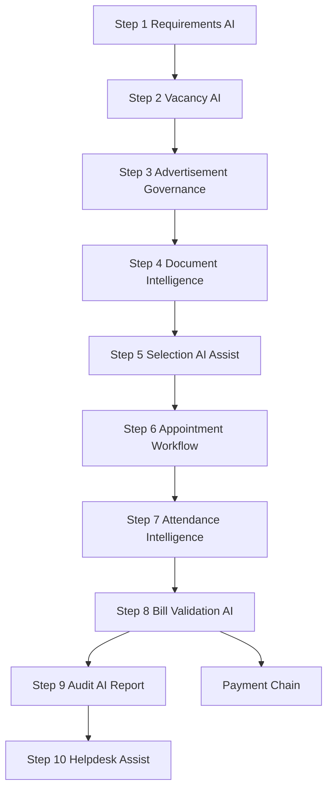

# CHB Portal — Comprehensive Backend Documentation

> [!IMPORTANT]
> This is the authoritative backend reference for the CHB Portal, merging architecture notes with detailed implementation snapshots through Step 9 (April 2026).

---

## 1. Executive Summary & Implementation Status

The CHB Portal backend is a structured, multi-step workflow platform built with FastAPI and SQLAlchemy Async. It handles the complete recruitment-to-payment lifecycle.

### 1.1 Implementation Coverage
The backend is fully implemented through **Step 9**:
1. **Step 1:** Requirement Generation (Norms, Intake, Faculty Needs)
2. **Step 2:** Vacancy Identification (Existing Faculty vs. Requirements)
3. **Step 3:** Advertisement Creation (Templates, Bilingual Generation)
4. **Step 4:** Candidate Application (Profile, AI-Powered Doc Validation)
5. **Step 5:** Selection Process (Scrutiny, Interview, Scoring Weights, AI Ranking)
6. **Step 6:** Appointment Management (Letter Generation, Credential Issuance)
7. **Step 7:** Attendance & Work Log (Timetable, Daily Logs, Anomaly Detection)
8. **Step 8:** Billing (Monthly Bill Generation, Sequential Approval Chain)
9. **Step 9:** Payment Disbursement (Transaction Initiation, Tracking, Retries)

### 1.2 End-to-End Workflow Graph

---

## 2. Technology Stack

| Category | Technology | Usage |
| :--- | :--- | :--- |
| **Language** | Python 3.10+ | Core logic implementation |
| **Framework** | FastAPI | REST APIs, OpenAPI, Dependency Injection |
| **ASGI Server**| Uvicorn | Production-ready async server |
| **ORM** | SQLAlchemy 2.0 | Async DB interaction via `asyncpg` |
| **Migrations** | Alembic | Versioned database schema evolution |
| **Validation** | Pydantic v2 | Request/Response schema validation |
| **Auth** | JWT (python-jose) | Role-Based Access Control (RBAC) |
| **Hashing** | Passlib (bcrypt) | Secure password/credential storage |
| **PDF Engine** | ReportLab | Dynamic appointment letter generation |
| **Files** | Local FS Abstraction| Replaceable storage service for uploads |

---

## 3. Architecture & Patterns

### 3.1 Directory Structure
- `app/api/`: Core foundational routes (Auth, Requirements).
- `app/core/`: Security, JWT, global config, and RBAC helpers.
- `app/db/`: Session management and engine configuration.
- `app/dependencies/`: Cross-cutting guards (e.g., `verify_institution_access`).
- `app/models/`: SQLAlchemy table models and shared enums.
- `app/modules/`: Business-domain feature packages (Step 2 to Step 9).
- `app/services/`: Shared utilities (Storage, Encryption, Notification).

### 3.2 Layering Strategy
Each feature module follows a consistent **Router -> Controller -> Service** pattern:
- **Router**: Defines endpoints, attaches role guards, and accepts request schemas.
- **Controller**: High-level orchestration and response formatting.
- **Service**: Heavy lifting, business logic, DB transactions, and audit logging.
- **Engines**: Decoupled complex logic (e.g., `RankingEngine`, `TemplateEngine`, `AnomalyEngine`).

### 3.3 Exception Handling
- **Normalization**: `app/main.py` catches `IntegrityError` and `HTTPException` to return a standard envelope.
- **Envelope**:
    - Success: `{ "status": "success", "data": {...} }`
    - Error: `{ "status": "error", "code": "...", "message": "..." }`

---

## 4. Role-Based Access Control (RBAC)

The system enforces three layers of security:
1. **Role Layer (`RoleChecker`)**: FastAPI dependency blocks unauthorized roles at the route level.
2. **Permission Layer (`PermissionChecker`)**: Granular action-based checks (e.g., `VACANCY_MANAGE`).
3. **Data Layer (Scoping)**: Users are scoped by `institution_id` or ownership (e.g., Candidates see only their own apps).

### Current Roles (`RoleEnum`):
`ADMIN`, `PRINCIPAL`, `CANDIDATE`, `FACULTY`, `RO`, `DIRECTORATE`, `TREASURY`.

---

## 5. Detailed Module Reference (Steps 1-9)

### 5.1 Step 3 - Advertisement Creation
- **Module**: `app/modules/advertisement/`
- **Engine**: `TemplateEngine` handles bilingual Marathi/English generation.
- **Status Flow**: `DRAFT` -> `REVIEW` -> `APPROVED` -> `PUBLISHED`.
- **Note**: Published advertisements are immutable.

### 5.2 Step 4 - Candidate & AI Engine
- **Module**: `app/modules/candidate/` & `application/`
- **AI Validation Engine**:
    - **Rule 1**: File integrity/PDF parseable.
    - **Rule 2**: File size <= 2MB.
    - **Rule 3**: Blank check (Density threshold).
    - **Rule 4**: Duplicate check (SHA-256 hash).
    - **Rule 5**: Image quality (Min pixels/DPI).
- **Security**: Aadhar is hashed with SHA-256; raw values are never stored.

### 5.3 Step 5 - Selection & Scoring
- **Module**: `app/modules/selection/` & `scoring_weights/`
- **Weight Resolution**: Fallback from Advertisement -> Course -> Level -> System Default.
- **Ranking**: `RankingEngine` computes composite scores (Academic + Experience + Interview).

### 5.4 Step 6 - Appointment & Credentials
- **Module**: `app/modules/appointment/`
- **Output**: Generates signed PDF letters and issues `FACULTY` user accounts upon acceptance.
- **Note**: Temp passwords for faculty are never returned in plain text.

### 5.5 Step 7 - Attendance & Work Log
- **Module**: `app/modules/attendance/`
- **Logic**: Daily lecture logs verified by Principal.
- **Anomalies**: `AnomalyEngine` flags backdated logs, holiday logging, and excessive daily lectures.

### 5.6 Step 8 - Billing
- **Module**: `app/modules/billing/`
- **Workflow**: `PRINCIPAL (Submit) -> RO (Approve) -> DIRECTORATE (Approve) -> TREASURY (Approve)`.
- **Audit**: Sequential `bill_audit` entries track every movement in the approval chain.

### 5.7 Step 9 - Payments
- **Module**: `app/modules/payments/`
- **Idempotency**: `UNIQUE(bill_id)` prevents double-disbursement.
- **Tracking**: Real-time status: `INITIATED` -> `PROCESSING` -> `SUCCESS` | `FAILED`.

---

## 6. Operational Notes

### 6.1 Configuration
- `app/core/config.py` manages environment variables.
- `MAX_DAILY_LECTURES_POLICY` (default: 6) controls attendance anomaly thresholds.

### 6.2 Primary Identifiers
- **Core Tables**: Use `Integer` primary keys for historical compatibility (Users, Institutions).
- **Workflow Tables**: Use `UUID` for non-guessable identifiers (Apps, Bills, Payments).

### 6.3 Postman Coverage
`CHB_Portal.postman_collection.json` is updated through Step 9, including pre-scripts for token handling and tests for all success/error cases.

---
*Last Updated: 2026-04-24*
*Status: Production-Ready Baseline*

---

## 7. April 2026 AI Expansion Update (Step 5 to Step 10)

This section documents the latest enterprise-grade AI enhancements implemented after the baseline release. These updates are additive and do not replace existing deterministic workflow controls.

### 7.1 AI Governance Principles

- AI outputs are advisory and explainable.
- AI never bypasses approval chain or RBAC gates.
- AI responses are structured JSON and include confidence scoring.
- Deterministic workflow state remains system-of-record.

### 7.2 Cross-Module AI Runtime Pattern

All AI-enabled modules now follow:

- `ai_engine.py`: domain logic + LLM augmentation
- `ai_service.py`: orchestration and output shaping
- Router/Controller: additive response fields (`ai_analysis` / `ai_validation`)

### 7.3 Step 5: Interview & Selection AI

Implemented in:

- `app/modules/selection/ai_engine.py`
- `app/modules/selection/ai_service.py`

Integrated endpoint:

- `POST /api/selection/rounds/{round_id}/rank`

Additive response field:

- `ai_analysis`

AI outputs:

- ranking suggestions and top-candidate dashboard
- bias flags (`UNIFORM_INTERVIEW_MARKS`, `HIGH_QUALIFICATION_LOW_RANK`, `RESERVATION_IMBALANCE`)
- score distribution and governance insights
- confidence score

### 7.4 Step 7: Attendance Intelligence AI

Implemented in:

- `app/modules/attendance/ai_engine.py`
- `app/modules/attendance/ai_service.py`

Integrated endpoint:

- `GET /api/attendance/anomalies`

Additive response field:

- `ai_analysis`

AI outputs:

- derived risk patterns from anomaly history
- risk classification (`LOW/MEDIUM/HIGH`)
- repeated-pattern insights
- confidence score

### 7.5 Step 8: Bill Validation AI

Implemented in:

- `app/modules/billing/ai_engine.py`
- `app/modules/billing/ai_service.py`

Integrated endpoint:

- `POST /api/billing/generate`

Additive response field:

- `ai_validation`

AI outputs:

- `validation_status` (`VALID` / `REVIEW_REQUIRED`)
- risk flags for policy / log consistency
- approval probability
- bill readiness insights

### 7.6 Step 9: Audit & Compliance AI

Implemented in:

- `app/modules/audit/ai_engine.py`
- `app/modules/audit/ai_service.py`
- `app/modules/audit/service.py`
- `app/modules/audit/controller.py`
- `app/modules/audit/router.py`

New endpoint:

- `GET /api/audit/ai-report` (ADMIN only)

AI outputs:

- audit summary
- policy deviation flags
- risk level
- bottleneck and timeline insights

### 7.7 Step 10: AI Helpdesk

Implemented in:

- `app/modules/helpdesk/ai_engine.py`
- `app/modules/helpdesk/ai_service.py`
- `app/modules/helpdesk/schemas.py`
- `app/modules/helpdesk/controller.py`
- `app/modules/helpdesk/router.py`

New endpoint:

- `POST /api/helpdesk/query`

Capabilities:

- bilingual (`EN` / `MR`) response routing
- approved-knowledge constrained answers
- confidence scoring

### 7.8 LLM Layer Enhancements

Updated shared service:

- `app/services/llm_service.py`

Enhancements:

- provider-safe initialization and guardrails
- normalized confidence coercion and anomaly typing
- module-agnostic method `analyze_custom_json(prompt)`
- deterministic fallback behavior when LLM unavailable

### 7.9 Updated End-to-End AI Control Graph

### 7.10 Backward Compatibility Notes

- Existing endpoint contracts are preserved.
- New AI payloads are additive only.
- No destructive schema changes introduced.
- Existing audit, approval, and role checks remain mandatory.

---
*AI Expansion Updated: 2026-04-26*
*Scope: Step 5 to Step 10 enterprise AI integration*
