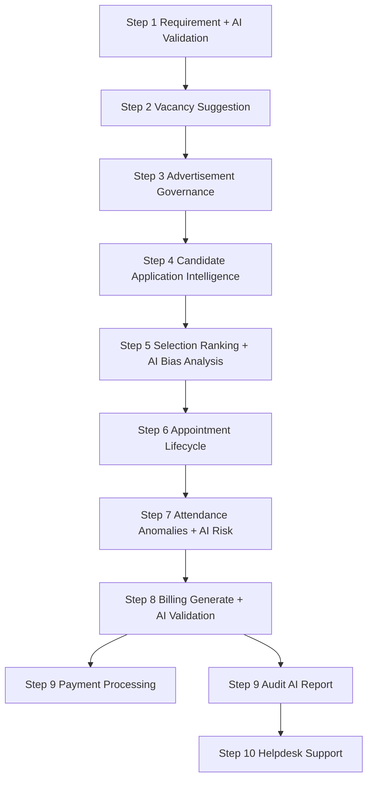

# CHB Portal — System & API Specification

This document outlines the roles, access control, workflow steps, and API endpoints for the CHB (Clock Hour Basis) Portal.

---

## 1. Stakeholder Roles & Access Control

The CHB Portal has **7 stakeholder roles**. Each role maps to a specific set of permissions that control both backend API access and frontend UI visibility.

### 1.1 Role Overview

| Role | Code | Description | Scope |
|------|------|-------------|-------|
| **System Administrator** | `ADMIN` | Manages system-wide configuration, norms, approvals, and user accounts | Global (all institutions) |
| **College Principal** | `PRINCIPAL` | Manages their own institution's vacancy, recruitment, attendance, and billing | Single institution |
| **Job Candidate** | `CANDIDATE` | Applies for CHB faculty positions, manages profile and documents | Own profile only |
| **CHB Faculty** | `FACULTY` | Logs daily lectures, views own bills and payment status | Own records only |
| **Regional Officer** | `RO` | First-level bill approver in the payment chain | Assigned region |
| **Directorate Officer** | `DIRECTORATE` | Second-level bill approver in the payment chain | State-wide |
| **Treasury Officer** | `TREASURY` | Final bill approver and payment disburser | State-wide |

### 1.2 ADMIN — System Administrator

**Who**: DTE (Directorate of Technical Education) back-office staff who configure and oversee the entire CHB process.

**Responsibilities**:
- Create and manage institutions, courses, and norms
- Define student intake and generate faculty requirements (Step 1)
- Set global scoring weight configurations
- Approve/publish advertisements created by Principals
- Approve appointment letters
- Issue faculty credentials after candidate acceptance
- Create billing rate masters
- View audit logs across the entire system

**Permissions**: `USERS_MANAGE`, `GLOBAL_CONFIG`, `AUDIT_VIEW`

**Frontend Visibility**:
- Dashboard: System-wide statistics (total institutions, active ads, pending approvals)
- Sidebar: Requirements, Scoring Weights, Advertisement Approval, Appointment Approval, Billing Rates, Payments Overview, Audit Logs, User Management
- Buttons: Create Institution, Create Norm, Define Intake, Generate Requirement, Approve Ad, Publish Ad, Approve Appointment, Issue Appointment, Cancel Appointment, Issue Credentials, Create Rate, Generate Bulk Bills

**Hidden from ADMIN**: Candidate profile forms, job application forms, lecture log entry, vacancy suggestion/confirmation

### 1.3 PRINCIPAL — College Principal

**Who**: Head of a specific institution (college) who manages their own institution's CHB recruitment and operations.

**Responsibilities**:
- Add, update, and soft-delete existing faculty records (Step 2)
- Run AI-powered vacancy suggestion and confirm final vacancy count (Step 2)
- Generate advertisement drafts and submit for Admin approval (Step 3)
- Manage the selection process: create rounds, shortlist, mark attendance, enter marks, generate rankings, confirm selections (Step 5)
- Override scoring weights for their institution's advertisements
- Generate appointment letters and submit for Admin approval (Step 6)
- Create timetables, manage academic calendar, verify faculty lecture logs (Step 7)
- Generate and submit monthly CHB bills for approval chain (Step 8)

**Permissions**: `VACANCY_MANAGE`, `AD_MANAGE`, `SELECTION_MANAGE`, `APPOINTMENT_MANAGE`, `RATE_MANAGE`, `ATTENDANCE_VERIFY`

**Data Scope**: Institution-scoped — can ONLY access data belonging to their own `institution_id`. Any cross-institution attempt returns `403 Forbidden`.

**Frontend Visibility**:
- Sidebar: Faculty Management, Vacancy Assessment, Advertisement, Selection Rounds, Scoring Weights (override), Appointments, Timetable & Calendar, Attendance Verification, Billing

**Hidden from PRINCIPAL**: User management, global norms/intake, approve/publish ad, approve/issue appointment, bill approval chain (RO/Dir/Treasury), payment processing, other institutions' data

### 1.4 CANDIDATE — Job Candidate

**Who**: A person applying for a CHB faculty position at a college.

**Responsibilities**:
- Create and maintain personal profile (qualifications, experience, Aadhar)
- Browse published advertisements
- Apply to positions, upload required documents, submit applications
- Accept or decline issued appointment letters

**Permissions**: `PROFILE_MANAGE`, `JOB_APPLY`, `APPOINTMENT_ACCEPT`

**Data Scope**: Own profile only — can only see/modify their own profile, applications, and appointment letters addressed to them.

**Frontend Visibility**:
- Sidebar: My Profile, Browse Jobs, My Applications, My Appointments
- Buttons: Edit Profile, Add Qualification, Add Experience, Apply, Upload Document, Submit Application, Withdraw, Accept/Decline Appointment

**Hidden from CANDIDATE**: All admin/institutional management, faculty management, vacancy, selection, attendance, billing, payment modules

### 1.5 FACULTY — CHB Faculty Member

**Who**: A Clock Hour Basis faculty member who has accepted an appointment and been issued credentials.

**Responsibilities**:
- Log daily lectures (subject, topic, duration, student count)
- Submit lecture logs for Principal verification
- View own generated bills and payment status

**Permissions**: `ATTENDANCE_LOG`, `BILL_VIEW`

**Data Scope**: Own records only — can only create/edit own lecture logs, view own timetable, see bills against their credential ID.

**Frontend Visibility**:
- Sidebar: My Timetable, Lecture Log, My Bills, My Payments
- Buttons: Create Lecture Log, Edit Log, Submit Log, Bulk Submit

**Hidden from FACULTY**: Vacancy, advertisement, selection, appointment management, bill generation/approval, rate management, other faculty data

### 1.6 RO — Regional Officer

**Who**: Government officer at the regional level for first-level financial verification of CHB bills.

**Responsibilities**: Review and approve/reject CHB bills submitted by Principals. First checkpoint: Principal → **RO** → Directorate → Treasury.

**Permissions**: `BILL_APPROVE_RO`

**Frontend Visibility**: Bill Approval Queue, Bill Details, Approval History. Buttons: Approve Bill, Reject Bill.

### 1.7 DIRECTORATE — Directorate Officer

**Who**: State-level officer for second-level bill verification.

**Responsibilities**: Review and approve/reject bills that passed RO approval. Second checkpoint: Principal → RO → **Directorate** → Treasury.

**Permissions**: `BILL_APPROVE_DIR`

**Frontend Visibility**: Bill Approval Queue, Bill Details, Approval History. Buttons: Approve Bill, Reject Bill.

### 1.8 TREASURY — Treasury Officer

**Who**: State Treasury officer for final bill approval and payment disbursement.

**Responsibilities**: Final bill approval, initiate payments, process payments (mark completed with UTR), retry failed payments.

**Permissions**: `BILL_APPROVE_TRE`

**Frontend Visibility**: Bill Approval Queue, Payment Management, Payment History. Buttons: Approve Bill, Reject Bill, Initiate Payment, Process Payment, Retry Payment.

---

## 2. Permission Registry & Frontend Integration

### 2.1 Role → Permission Mapping

```
ADMIN        → USERS_MANAGE, GLOBAL_CONFIG, AUDIT_VIEW
PRINCIPAL    → VACANCY_MANAGE, AD_MANAGE, SELECTION_MANAGE, APPOINTMENT_MANAGE, RATE_MANAGE, ATTENDANCE_VERIFY
CANDIDATE    → PROFILE_MANAGE, JOB_APPLY, APPOINTMENT_ACCEPT
FACULTY      → ATTENDANCE_LOG, BILL_VIEW
RO           → BILL_APPROVE_RO
DIRECTORATE  → BILL_APPROVE_DIR
TREASURY     → BILL_APPROVE_TRE
```

Source file: `app/core/permissions.py`

### 2.2 Login Response (includes permissions)

```json
{
  "access_token": "eyJ...",
  "token_type": "bearer",
  "user": {
    "id": 2,
    "email": "principal@college.edu",
    "role": "PRINCIPAL",
    "full_name": "Dr. Sharma",
    "permissions": ["VACANCY_MANAGE", "AD_MANAGE", "SELECTION_MANAGE", "APPOINTMENT_MANAGE", "RATE_MANAGE", "ATTENDANCE_VERIFY"]
  }
}
```

### 2.3 Frontend Conditional Rendering

```javascript
const perms = loginResponse.user.permissions;
const has = (p) => perms.includes(p);

showVacancyModule     = has("VACANCY_MANAGE");
showAdModule          = has("AD_MANAGE");
showSelectionModule   = has("SELECTION_MANAGE");
showAppointmentModule = has("APPOINTMENT_MANAGE");
showAttendanceModule  = has("ATTENDANCE_VERIFY") || has("ATTENDANCE_LOG");
showBillingModule     = has("RATE_MANAGE") || has("BILL_VIEW") || has("BILL_APPROVE_RO") || has("BILL_APPROVE_DIR") || has("BILL_APPROVE_TRE");
showPaymentsModule    = has("BILL_APPROVE_TRE");
showProfileModule     = has("PROFILE_MANAGE");
showJobsModule        = has("JOB_APPLY");
showUsersModule       = has("USERS_MANAGE");
showConfigModule      = has("GLOBAL_CONFIG");
showAuditModule       = has("AUDIT_VIEW");
```

### 2.4 Permission → UI Element Mapping

| Permission | Sidebar Items | Buttons |
|------------|--------------|---------|
| `USERS_MANAGE` | User Management | Create User, Deactivate User |
| `GLOBAL_CONFIG` | Requirements, Norms, Intake, Scoring Weights (global) | Create Institution, Create Norm, Define Intake, Generate Requirement |
| `AUDIT_VIEW` | Audit Logs | View Audit Trail |
| `VACANCY_MANAGE` | Faculty Management, Vacancy Assessment | Add/Edit/Delete Faculty, Suggest/Confirm Vacancy, Acknowledge Anomaly |
| `AD_MANAGE` | Advertisement | Generate Ad, Edit Ad, Submit Ad |
| `SELECTION_MANAGE` | Selection Rounds | Create Round, Shortlist, Attendance, Enter Marks, Rank, Confirm |
| `APPOINTMENT_MANAGE` | Appointments | Generate, Edit, Submit Appointment |
| `RATE_MANAGE` | Billing Rates | View Rates |
| `ATTENDANCE_VERIFY` | Attendance Verification | Verify Log, View/Acknowledge Anomalies |
| `PROFILE_MANAGE` | My Profile | Edit Profile, Add Qualification/Experience |
| `JOB_APPLY` | Browse Jobs, My Applications | Apply, Upload, Submit, Withdraw |
| `APPOINTMENT_ACCEPT` | My Appointments | Accept, Decline |
| `ATTENDANCE_LOG` | Timetable, Lecture Log | Create/Edit/Submit Log |
| `BILL_VIEW` | My Bills | View Bill Detail |
| `BILL_APPROVE_RO` | Bill Approval Queue | Approve/Reject (RO stage) |
| `BILL_APPROVE_DIR` | Bill Approval Queue | Approve/Reject (Directorate stage) |
| `BILL_APPROVE_TRE` | Bill Approval + Payments | Approve/Reject, Initiate/Process/Retry Payment |

### 2.5 Data Scoping Rules

| Role | Scope | Enforcement |
|------|-------|-------------|
| ADMIN | Global | No institution filter |
| PRINCIPAL | Own institution | `user.institution_id` must match resource. Enforced by `verify_institution_access()` |
| CANDIDATE | Own profile/apps | `application.candidate_id` must match. Service-layer ownership checks |
| FACULTY | Own logs/bills | `faculty_credential.user_id` must match. `_assert_read_scope()` |
| RO | Bills at RO stage | `bill.current_approver_role == "RO"`. `_assert_read_scope()` |
| DIRECTORATE | Bills at Dir stage | `bill.current_approver_role == "DIRECTORATE"`. `_assert_read_scope()` |
| TREASURY | Bills at Treasury + payments | `bill.current_approver_role == "TREASURY"`. `_assert_read_scope()` |

### 2.6 Technical Enforcement (Two Layers)

**Layer 1 — Route-Level (`RoleChecker`)**: FastAPI dependency blocks unauthorized roles before business logic.

```python
principal_only = RoleChecker([RoleEnum.PRINCIPAL])
@router.post("/generate", dependencies=[Depends(principal_only)])
```

**Layer 2 — Service-Level (Data Scoping)**: Institution and ownership checks inside service methods.

```python
async def _assert_principal_scope(self, current_user, institution_id):
    if current_user.role == RoleEnum.PRINCIPAL and current_user.institution_id != institution_id:
        raise HTTPException(403, "You do not have access to this institution's data")
```

Key files: `app/core/permissions.py`, `app/core/security.py`, `app/dependencies/institution_scope.py`, `app/schemas/user.py`

---

## 3. API Summary by Step

| Step | Module | API Count |
| :--- | :--- | :--- |
| **Core** | Auth - User Management | 8 |
| **Step 1** | Requirement Generation | 7 |
| **Step 2** | Vacancy Identification | 5 |
| **Step 3** | Advertisement | 6 |
| **Step 4** | Candidate Application | 11 |
| **Step 5** | Selection Process | 15 |
| **Step 6** | Appointment Letter | 6 |
| **Step 7** | Attendance & Work Log | 6 |
| **Step 8** | Bill Generation | 6 |
| **Step 9** | Approval Workflow | 7 |
| **Total** | | **~72 APIs** |

---

## 4. Core APIs

| Method | Endpoint | Description |
| :--- | :--- | :--- |
| `POST` | `/auth/login` | User authentication. |
| `POST` | `/auth/logout` | Terminate session. |
| `POST` | `/auth/refresh-token` | Refresh authentication token. |
| `GET` | `/auth/me` | Get current user profile + permissions. |
| `POST` | `/auth/forgot-password` | Request password reset link. |
| `POST` | `/auth/reset-password` | Reset password using token. |
| `POST` | `/users` | Create new users (Admin only). |
| `GET` | `/users/:id` | Fetch specific user details. |

---

## 5. Step 1 — Requirement Generation (7 APIs)

| Method | Endpoint | Description |
| :--- | :--- | :--- |
| `POST` | `/requirements/institutions` | Admin creates institution + courses. |
| `GET` | `/requirements/institutions` | List all institutions with courses. |
| `POST` | `/requirements/intake` | Admin defines student intake per course. |
| `POST` | `/requirements/norms` | Admin sets faculty:student ratio norms. |
| `GET` | `/requirements/norms` | Fetch current system norms. |
| `POST` | `/requirements/generate` | Calculate required faculty from intake + norms. |
| `POST` | `/requirements/validate` | AI flags anomalies in generated requirements. |

---

## 6. Step 2 — Vacancy Identification (Implemented)

Module: `app/modules/vacancy/`

Key business output used by Step 3:
- `vacancy_assessments` row with `status = CONFIRMED` and `confirmed_vacancy` set.

### Endpoint Access

| Method | Endpoint | Allowed Roles |
| :--- | :--- | :--- |
| `POST` | `/vacancies/faculty` | PRINCIPAL |
| `PUT` | `/vacancies/faculty/{id}` | PRINCIPAL |
| `GET` | `/vacancies/faculty` | ADMIN, PRINCIPAL |
| `DELETE` | `/vacancies/faculty/{id}` | PRINCIPAL |
| `POST` | `/vacancies/suggest` | PRINCIPAL |
| `GET` | `/vacancies/assessment` | ADMIN, PRINCIPAL |
| `POST` | `/vacancies/confirm` | PRINCIPAL |
| `POST` | `/vacancies/anomalies/{id}/acknowledge` | PRINCIPAL |

---

## 7. Step 3 — Advertisement Creation (Implemented, 7 APIs)

Module: `app/modules/advertisement/`

### 7.1 Workflow

- `DRAFT` → `REVIEW` → `APPROVED` → `PUBLISHED`
- `REVIEW` → `REJECTED` (with reason) → back to `DRAFT` for edits

Business gates:
- Cannot generate unless assessment is `CONFIRMED`
- Cannot have two active ads for the same `(institution_id, course_id, academic_year)`
- Cannot publish unless `APPROVED`
- Once `PUBLISHED`, advertisement is immutable

### 7.2 Step 3 APIs (Actual)

Prefix: `/api/advertisements`

| Method | Endpoint | Role | Notes |
| :--- | :--- | :--- | :--- |
| `POST` | `/advertisements/generate` | PRINCIPAL | Generates bilingual `DRAFT` ad from templates + confirmed assessment. |
| `GET` | `/advertisements/{advertisement_id}` | PRINCIPAL, ADMIN | Returns ad with audit trail; principal is institution-scoped. |
| `PUT` | `/advertisements/{advertisement_id}` | PRINCIPAL | Allowed only in `DRAFT` or `REJECTED`. |
| `POST` | `/advertisements/{advertisement_id}/submit` | PRINCIPAL | Moves to `REVIEW` after validations. |
| `POST` | `/advertisements/{advertisement_id}/approve` | ADMIN | Approve or reject with remarks. |
| `POST` | `/advertisements/{advertisement_id}/publish` | ADMIN | Publishes and returns `public_token` + public URL. |
| `GET` | `/advertisements/public/{public_token}` | PUBLIC | Public-safe payload only (no internal IDs). |

### 7.3 Template Placeholders

- `{{institution_name}}`, `{{course_name}}`, `{{vacancy_count}}`, `{{academic_year}}`
- `{{application_deadline}}`, `{{designation}}`, `{{qualification}}`

---

## 8. Step 4 — Candidate Application (Implemented, 11 APIs)

Module: `app/modules/candidate/` and `app/modules/application/`

### 8.1 Workflow

- `DRAFT` → `SUBMITTED` → `UNDER_REVIEW` → `SHORTLISTED` or `REJECTED`
- `DRAFT` or `SUBMITTED` → `WITHDRAWN` (soft delete)

Business gates:
- Profile must be complete before creating application
- Advertisement must be PUBLISHED and within application window
- One application per candidate per advertisement
- Required documents must be uploaded and not INVALID
- Declaration must be accepted before submission

### 8.2 Step 4 APIs (Actual)

Prefix: `/api/candidates` and `/api/applications`

| Method | Endpoint | Role | Notes |
| :--- | :--- | :--- | :--- |
| `POST` | `/candidates/profile` | CANDIDATE | Upsert profile. Hashes Aadhar (SHA-256). |
| `GET` | `/candidates/profile` | CANDIDATE | Returns profile with qualifications/experience. No raw Aadhar. |
| `POST` | `/candidates/qualifications` | CANDIDATE | Bulk add. Validates year, percentage, single is_highest. |
| `POST` | `/candidates/experience` | CANDIDATE | Bulk add. Validates date ranges, is_current logic. |
| `POST` | `/applications` | CANDIDATE | Create DRAFT application. Auto-generates CHB-YYYY-XXXXX number. |
| `POST` | `/applications/{id}/documents` | CANDIDATE | Upload document (multipart). Triggers async AI validation. |
| `GET` | `/applications/{id}/documents` | CANDIDATE, PRINCIPAL | List documents with validation_status per doc. |
| `POST` | `/applications/{id}/submit` | CANDIDATE | Submit with declaration. All required docs must be valid. |
| `DELETE` | `/applications/{id}/withdraw` | CANDIDATE | Soft withdraw. Only DRAFT/SUBMITTED. |
| `GET` | `/applications/my` | CANDIDATE | List own applications. |
| `GET` | `/applications` | PRINCIPAL, ADMIN | List all applications. Principal institution-scoped. |

### 8.3 Document Validation Rules

| # | Rule | Result |
| :--- | :--- | :--- |
| 1 | File format check (PDF/Image parseable) | INVALID if corrupted |
| 2 | File size ≤ 2MB | INVALID if over |
| 3 | Blank document check (PDF text < 50 chars) | SUSPICIOUS |
| 4 | Duplicate file (SHA-256 hash match in same app) | INVALID |
| 5 | Photo minimum 200×200 pixels | INVALID if too small |
| 6 | Document type mismatch | SUSPICIOUS |
| 7 | Year detection in degree/marksheet PDFs | WARNING if not found |

---

## 9. Step 5 — Selection Process (Implemented, 15 APIs)

Module: `app/modules/selection/` and `app/modules/scoring_weights/`

### 9.1 Weight Resolution Priority

1. **Advertisement Level**: Custom override by Principal for specific notice.
2. **Course + Level**: Specific to a subject and degree type.
3. **Course Level**: Specific to a subject across all levels.
4. **Degree Level**: Specific to degree type (e.g., all UG).
5. **DEFAULT**: System-wide fallback (30/25/30/10/5).

### 9.2 Step 5 APIs (Actual)

#### Selection Workflow (Prefix: `/api/selection`)

| Method | Endpoint | Role | Notes |
| :--- | :--- | :--- | :--- |
| `POST` | `/rounds` | PRINCIPAL | Schedule Scrutiny or Interview round. |
| `POST` | `/rounds/{id}/shortlist` | PRINCIPAL | Bulk shortlist candidates from SUBMITTED applications. |
| `GET` | `/rounds/{id}/shortlisted` | PRINCIPAL, ADMIN | List candidates with current eval status. |
| `POST` | `/rounds/{id}/attendance` | PRINCIPAL | Mark candidate presence. |
| `POST` | `/marks` | PRINCIPAL | Enter subject, teaching, comms, and impression marks. |
| `PUT` | `/marks/{id}` | PRINCIPAL | Allowed only if not locked. |
| `POST` | `/rounds/{id}/rank` | PRINCIPAL | Trigger AI ranking engine using resolved weights. |
| `GET` | `/rounds/{id}/ranked-list` | PRINCIPAL, ADMIN | View ranked list with full score breakdowns. |
| `POST` | `/rounds/{id}/confirm` | PRINCIPAL | Finalize results. Applications move to SHORTLISTED/REJECTED. |
| `GET` | `/results/{ad_id}` | PRINCIPAL, ADMIN | View final confirmed merit lists. |

#### Weight Configuration (Prefix: `/api/scoring-weights`)

| Method | Endpoint | Role | Notes |
| :--- | :--- | :--- | :--- |
| `POST` | `/` | ADMIN | Create global/course/level configs. |
| `POST` | `/advertisement/{id}` | PRINCIPAL | Override weights for a specific advertisement. |
| `GET` | `/resolve` | ADMIN, PRINCIPAL | Dry-run: see which weights will apply. |
| `GET` | `/` | ADMIN | List all active configs. |
| `DELETE` | `/{id}` | ADMIN | Soft delete config. |

---

## 10. Step 6 — Appointment Management (Implemented, 10 APIs)

Module: `app/modules/appointment/`

### 10.1 Workflow

- `DRAFT` → `SUBMITTED` → `APPROVED` → `ISSUED` → `ACCEPTED` / `DECLINED`
- `APPROVED` → `CANCELLED` (by Admin with reason)

### 10.2 Step 6 APIs (Actual)

Prefix: `/api/appointments`

| Method | Endpoint | Role | Notes |
| :--- | :--- | :--- | :--- |
| `POST` | `/generate` | PRINCIPAL | Generate appointment letter from selection result. |
| `GET` | `/{id}` | ADMIN, PRINCIPAL, CANDIDATE | View appointment details. |
| `PUT` | `/{id}` | PRINCIPAL | Update draft appointment. |
| `POST` | `/{id}/submit` | PRINCIPAL | Submit for Admin approval. |
| `POST` | `/{id}/approve` | ADMIN | Approve appointment letter. |
| `POST` | `/{id}/issue` | ADMIN | Issue to candidate. |
| `POST` | `/{id}/respond` | CANDIDATE | Accept or decline. |
| `POST` | `/{id}/cancel` | ADMIN | Cancel with reason. |
| `POST` | `/{id}/credentials` | ADMIN | Issue faculty credentials after acceptance. |
| `GET` | `/institution/{id}` | ADMIN, PRINCIPAL | List appointments by institution. |

---

## 11. Step 7 — Attendance & Work Log (Implemented, 14 APIs)

Module: `app/modules/attendance/`

### 11.1 Step 7 APIs (Actual)

Prefix: `/api/attendance`

| Method | Endpoint | Role | Notes |
| :--- | :--- | :--- | :--- |
| `POST` | `/timetable` | PRINCIPAL | Create timetable slots. |
| `GET` | `/timetable/{faculty_id}` | ADMIN, PRINCIPAL, FACULTY | View timetable. |
| `PUT` | `/timetable/{slot_id}` | PRINCIPAL | Update slot. |
| `POST` | `/calendar` | ADMIN, PRINCIPAL | Upsert academic calendar. |
| `GET` | `/calendar` | ADMIN, PRINCIPAL, FACULTY | View calendar. |
| `POST` | `/logs` | FACULTY | Create lecture log. |
| `GET` | `/logs` | ADMIN, PRINCIPAL, FACULTY | List logs (scoped). |
| `GET` | `/logs/summary` | ADMIN, PRINCIPAL, FACULTY | Monthly summary. |
| `POST` | `/logs/bulk-submit` | FACULTY | Bulk submit logs. |
| `PUT` | `/logs/{id}` | FACULTY | Edit draft log. |
| `POST` | `/logs/{id}/submit` | FACULTY | Submit for verification. |
| `POST` | `/logs/{id}/verify` | PRINCIPAL | Verify/reject log. |
| `GET` | `/anomalies` | ADMIN, PRINCIPAL | List attendance anomalies. |
| `POST` | `/anomalies/{id}/acknowledge` | PRINCIPAL | Acknowledge anomaly. |

---

## 12. Step 8 — Billing (Implemented, 12 APIs)

Module: `app/modules/billing/`

### 12.1 Step 8 APIs (Actual)

Prefix: `/api/billing`

| Method | Endpoint | Role | Notes |
| :--- | :--- | :--- | :--- |
| `POST` | `/rates` | ADMIN | Create billing rate master. |
| `GET` | `/rates` | ADMIN, PRINCIPAL | List rates. |
| `PUT` | `/rates/{id}` | ADMIN | Update rate. |
| `POST` | `/generate` | ADMIN, PRINCIPAL | Generate monthly bill. |
| `POST` | `/generate/bulk` | ADMIN | Bulk generate bills. |
| `POST` | `/bills/{id}/submit` | PRINCIPAL | Submit bill to approval chain. |
| `POST` | `/bills/{id}/approve` | PRINCIPAL, RO, DIRECTORATE, TREASURY | Multi-stage approval. |
| `GET` | `/bills/{id}/approvals` | ALL BILLING ROLES | View approval history. |
| `GET` | `/bills` | ALL BILLING ROLES | List bills (scoped by role). |
| `GET` | `/bills/summary` | PRINCIPAL, ADMIN | Billing summary. |
| `GET` | `/bills/{id}` | ALL BILLING ROLES | Bill detail. |
| `POST` | `/bills/{id}/regenerate` | ADMIN, PRINCIPAL | Regenerate rejected bill. |

### 12.2 Bill Approval Chain

```
Principal (submit) → RO (approve) → Directorate (approve) → Treasury (approve) → Payment
```

Each approver can only act when `bill.current_approver_role` matches their own role. If rejected, the bill returns to `REJECTED` and the Principal can regenerate.

---

## 13. Step 9 — Payments (Implemented, 5 APIs)

Module: `app/modules/payments/`

### 13.1 Step 9 APIs (Actual)

Prefix: `/api/payments`

| Method | Endpoint | Role | Notes |
| :--- | :--- | :--- | :--- |
| `POST` | `/initiate/{bill_id}` | TREASURY, ADMIN | Initiate payment for approved bill. |
| `POST` | `/process/{id}` | TREASURY | Mark payment completed with UTR. |
| `POST` | `/retry/{id}` | TREASURY | Retry failed payment. |
| `GET` | `/{id}` | ADMIN, TREASURY, FACULTY | View payment detail. |
| `GET` | `/` | ADMIN, TREASURY | List all payments. |

---

*Last Updated: 2026-04-24*
*Source of Truth: Backend router files + `app/core/permissions.py`*

---

## 14. April 2026 Specification Update (AI Expansion)

This section appends the latest API and behavior specifications for enterprise AI features added after the baseline Step 1-9 implementation.

### 14.1 Updated API Summary by Step

| Step | Module | Latest API Notes |
| :--- | :--- | :--- |
| Step 1 | Requirements | AI validation remains additive, local LLM supported |
| Step 2 | Vacancy | AI suggestion + anomaly flow unchanged |
| Step 3 | Advertisement | Deterministic governance retained |
| Step 4 | Applications | Document intelligence retained |
| Step 5 | Selection | `rank` API now includes additive `ai_analysis` |
| Step 6 | Appointment | Unchanged workflow authority |
| Step 7 | Attendance | `anomalies` API now includes additive `ai_analysis` |
| Step 8 | Billing | `generate` API now includes additive `ai_validation` |
| Step 9 | Payments + Compliance | Payment APIs retained; new audit AI endpoint added |

### 14.2 New/Updated AI-Integrated Endpoints

| Method | Endpoint | Role | Change Type |
| :--- | :--- | :--- | :--- |
| `POST` | `/selection/rounds/{round_id}/rank` | PRINCIPAL | Response now includes `ai_analysis` |
| `GET` | `/attendance/anomalies` | ADMIN, PRINCIPAL | Response now includes `ai_analysis` |
| `POST` | `/billing/generate` | ADMIN, PRINCIPAL | Response now includes `ai_validation` |
| `GET` | `/audit/ai-report` | ADMIN | New endpoint |
| `POST` | `/helpdesk/query` | Authenticated users | New Step 10 endpoint |

### 14.3 AI Response Schema Additions

#### A) Selection Rank API

```json
{
  "status": "success",
  "data": [],
  "ai_analysis": {
    "rankings": [],
    "bias_flags": [],
    "insights": [],
    "comparison_dashboard": {
      "top_candidates": [],
      "score_distribution": {},
      "ranking_changes": []
    },
    "confidence_score": 0.0
  }
}
```

#### B) Attendance Anomalies API

```json
{
  "status": "success",
  "data": [],
  "ai_analysis": {
    "anomalies": [],
    "risk_level": "LOW",
    "insights": [],
    "confidence_score": 0.0
  }
}
```

#### C) Billing Generate API

```json
{
  "status": "success",
  "data": {},
  "ai_validation": {
    "validation_status": "VALID",
    "risk_flags": [],
    "approval_probability": 0.0,
    "insights": []
  }
}
```

### 14.4 AI-Enhanced Workflow Graph



### 14.5 RBAC Additions (AI-Specific)

- `GET /api/audit/ai-report`: ADMIN only.
- `POST /api/helpdesk/query`: available to all authenticated roles.
- AI additions on selection/attendance/billing respect existing route-level role checks and institution scoping.

### 14.6 Non-Breaking Compatibility Contract

- Existing routes remain valid.
- Existing deterministic business rules are unchanged.
- AI payloads are additive fields only.
- Approval and payment authorities remain human-driven.

---
*Specification Expansion Updated: 2026-04-26*
*Scope: Step 5 to Step 10 enterprise AI specification updates*
